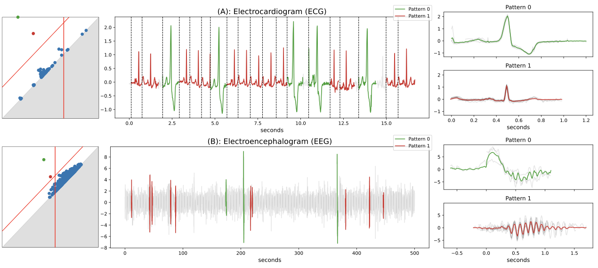

<h1 align="center">Persistence-based Motif Discovery in Time Series</h1>

<div align="center">
<p>
 
</p>
</div>

## Abstract
Motif Discovery consists in finding repeated patterns and locating their occurrences within time series without prior knowledge of their shape or location. Most state-of-the-art algorithms rely on three core parameters: the number of motifs to discover, the length of the motifs, and a similarity threshold between motif occurrences. In practice, these parameters are difficult to determine and are usually set by trial-and-error.

In this paper, we propose a new algorithm that discovers motifs of variable length without requiring a similarity threshold. At its core, the algorithm maps a time series onto a graph, summarizes it with persistent homology - a tool from topological data analysis - and identifies the most relevant motifs from the graph summary. We also present an adaptive version of the algorithm that infers the number of motifs to discover from the graph summary. Empirical evaluation on 9 labeled datasets, including 6 real-world datasets, shows that our method significantly outperforms state-of-the-art algorithms.

<p align="center">
  
  <figcaption>(left): Graph summaries also known as persistence diagrams, (middle): time series with colored motif sets, (right): motif sets with barycenters. <b>(A) Electrocardiogram:</b> ECG of a patient with premature ventricular contraction (PVC). The persistence diagram shows two significant motif sets; pattern 0 represents heartbeats with PVC, and pattern 1 represents normal heartbeats. Vertical dashed lines on the time series plot indicate the start location of the pattern occurrences. <b>(B) Electroencephalogram:</b> single-channel EEG of a patient in a second stage of sleep. The persistence diagram indicates two significant motif sets; pattern 0 represents K-complexes, and pattern~1 represents sleep spindles. Both patterns represent short bursts of brain activity that help resist awakening by external stimuli.</figcaption>
</p>


## Functionalities
- Paper's experimental results can be found in the jupyter notebook [exp_results_paper.ipynb](https://github.com/thibaut-germain/Persistent-Pattern-Discovery/exp_results_paper.ipynb)
- Paper's illustration can be found in the jupyter notebook [paper_illustration.ipynb](https://github.com/thibaut-germain/Persistent-Pattern-Discovery/paper_illustration.ipynb)
- To run an experiment, use the following command from the root folder:
  ```(bash)
  python experiment/<foldername>/script_<foldername>.py
  ```
  If all experiments are re-run, the new results can be displayed with thejupyter notebook [exp_results_paper.ipynb](https://github.com/thibaut-germain/Persistent-Pattern-Discovery/exp_results_paper.ipynb)


## Prerequisites

1.  download and unzip the datasets at the root folder from the following archive:

```(bash) 
https://drive.google.com/file/d/1tfOXKbk7rhAqF4jzuMkrgklcYU3qtWzY/view?usp=sharing
```
2. All python packages needed are listed in [requirements.txt](https://github.com/thibaut-germain/Persistent-Pattern-Discovery/requirements.txt) file and can be installed simply using the pip command: 

```(bash) 
conda create --name perspa --file requirements.txt
``` 


## Reference

If you use this work, please cite:

